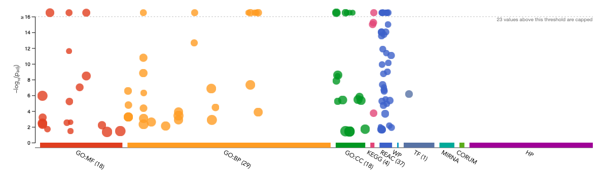
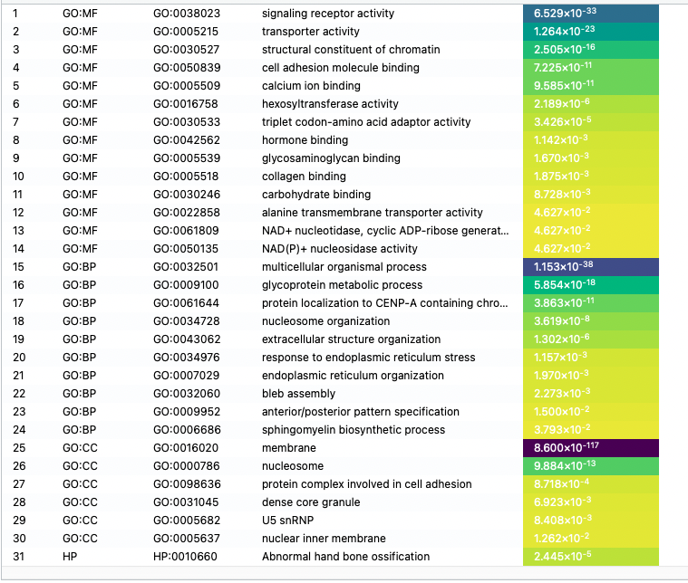
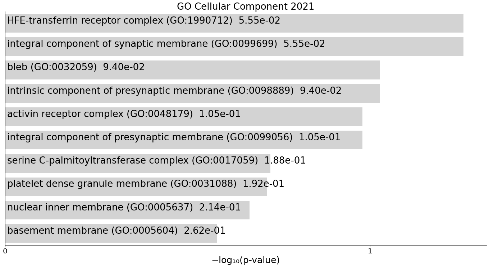
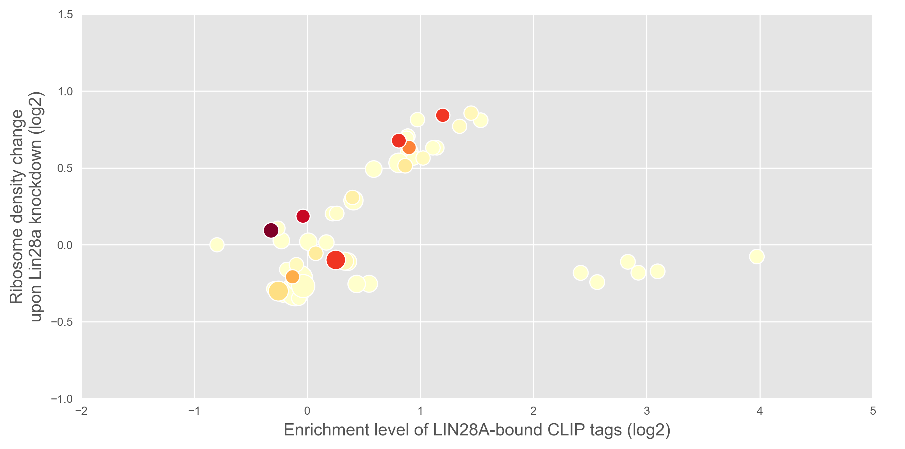

# Bioinformatics and Practice 1 Project
2023-spring
Seongeun Kim

---
## Gene Ontology Enrichment Analysis (GOEA)
All the code and data related to this project is in `./project` directory.

### Tools
- g:Convert
  Used to map ensembl gene id to gene symbol
- g:Profiler
  Used to perform GO analysis
- Enrichr
  Used to perform variety of enrichment analysis

### Data
- Used output file from termProj1

---

### Result
1. Result of GOEA from g:Profiler
    1.1 scatter plot
    

    1.2 term table
    

2. Result of GOEA from Enrichr
   

3. Visualization of GOEA result refer to the paper
   

---

Reference
- LIN28A Is a Suppressor of ER-Associated Translation in Embryonic Stem Cells 
  Cho, Jun et al. Cell, Volume 151, Issue 4, 765 - 777